# Namaste React 🚀🚀🚀
# converting a HTML into a react 
1.  init npm by using npm init, and answer the question to craete a package.json file
2.  install parcel as DEV dependencies by using npm install Parcel -D, -D is used to add DEV dependencies
3.  install react and react dom by using 
    a.  npm install react
    b.  npm install react-dom
4.  now run the server by using npx parcel index.html, application will run on a port
    --command for production build using parcel, npx parcel build index.html
    -- it will throw the error, you need to make the suggested code  

# Parcel
- Dev Build
- Local server
- HMR = Hot module replacement , means what ever changes you do it will automatically reflect on the browser, it is using file watching algo written in C ++ 
- Caching  - it gives faster builds   
- Image optimization
- Minification
- Bundling
- Compress
- Consistent Hashing
- Code splitting
- Differential Bundilng - support older browser
- Diagnostics
- Error Handling
- HTTPS hosting 
- Tree Shaking : remove unused code 

# Episode 04 | Talk is cheap, show me the code!!!
## In this Episode we have learned component, passing props, passing the dynamic data, using keys etc. 
- In this Episode we are going to build a food ordering app like zomato
- page layout looks like this
-
/*
* Header
* - Logo
* - NAV Items
* Body
* - Search 
* - Restaurant container
*   - Restaurant Card
*     - image
*     - name 
*     - star rating, cuisines, ETA,  
* Footer
* - Copyright
* - Links
* - Address
* - Contact
*/

- In this app we have done component composition and created a food ordering app which looks like as follows
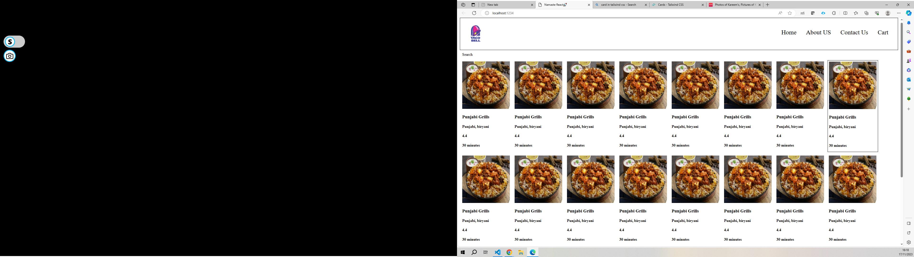
- For the UI devlopemnt we need to do the planning and we need to create a design or a mock up
- First of all we have make a card item which is static, now we are making it dynamic, so that we can have multiple restaurant
- to make card dynamic we are using props(properties), with props we can pass the dynaic data to the component, props are nothing but arguments to the function
- props are nothing but JS object, you can render props within { } with props.[propertyname] like props.resName
- You can pass any number of props to the component, react will wrap it and gives you a object called it as a props 
- you can also **destructure the props**, it gives the good visibility/readibility of the props, destructuring of props in not React concept, it is a JS concept
- From the backend, the data will come to us in the form of json
- **Config driven UI** , configurations are sent as a part of data 
- If we have a long list of props to be passed, it is a good practice that we can pass whole object as the Props  eg.  <RestaurantCard resData={resobj}/>, here RestaurantCard is the component resData is the props and resobj is nothing but the object containing the data, which may come from the API call
- Use optional chaining (?) and restructure the data, don't use the long object property name
- don't repeat youself use loop for binding the component

# Don't ignore the warnig or error
- in the console we are getting a warning , this error tells you that each item in the kist should be represented with a unique key
- here we are starting about Key, Key is the reserved keyword in React
- **why to use key?** , you should not use index as a key, it is not recommended, use only unique keys

### Understanding till now
- You can JSX and component to render the elemnt 
- you can use { } to execute the expression
- you can bind any component to any other component, it's called component composition
- you can use JSX element inside component or vice a versa
- you can use paired or unpaired tag to render the component 
- JSX and component are nothing but the object
- Babel is used for transpiling the code, it is the compiler  

=======================================================Episode 04 ends here======================================================================

# Episode-05 | Let's get Hooked 
- In this chapter we are going to cover react hooks 
- first of all create a seprate file for each component inside a component folder which is inside src folder
- export the component with the help of export default  and import the same component whenever it is required
- Do not keep any hard quoted data or URL, inside a component file, it is a industry standard, hard quoted data should be keep seprate like utils folder like constants.js
- There 2 types of Export and 2 types of Import, Default export, Named export and Default import, Named Import
- A file can not have more than 1 default export
- for named export just write the word "export" infront of element
- we can attach onclick evevnt to the button by adding a callback , eg `onClick={()=>{console.log("Button clicked")}}`
- **Notes** React solves the problem of consistency and dom manipulation, whenever the data changes the UI should change, UI layer and data layer should work in sync, updating the dom efficientely very fast with the help of virtual dom
- whenevre you want a functionality like when data is change your UI should change use **state variable**, to make any variable a state variable, we can use state hook, A react hook is nothing but a normal JS function with some super power, it is nothing but a utility function given by react

# React Hooks\
- Hooks are Normal JS utility function, these function is available inside React, for using Hooks, we need to import it 
- there are 2 very important hooks 1.useState()  2.useEffect(),  most of the time you use these 2 most importrnt hooks, there are other hook as well
- Whenever you see a function name starts with the name **use** it's a hook, it's a common convention 
## useState() Hook
- useState() => used for Super powerful state variable in React, you need to import it as a named import, it maintain the state for the component, [read more here](https://www.w3schools.com/react/react_usestate.asp) , as soon as the data changes which is using useState, the render of the UI happend automatically.
- useState() is returning array of 2 element in the form of array destructuiring, first is the pointer to actual data and second is a function which is nothing but a trigger, whenever the function gets called React Fiber algorithen start execution and do a new Render.
- we can use useStae like 
`const arr = useState(resList);`
`const [listOfRestaurants, setListOfRestraunt] = arr;` arr contains 2 element inside it as it is a array, which is equivalant to a one liner `const [listofRestaurant,setListofRestaurant] = useState(resList);`
- Whenever the local state variable changes/updates React re-render's the Component, React triggers a reconciliation cycle
- **Industry best standard** 1.Never create useState() outside your component. 2.Always create useState() on top where function start 3.Never create useState() inside if...else block or a for loop or a function, it create inconsistency

## useEffect() Hook
- We will be going to discuss in next chapter
# Internals of the Render
- React uses reconsiliation algorithem introduced in React 16, it is also known as React fibre, on UI we have a DOM, React creates a virtual DOM, when UI changes after any filteration, then the resultant UI changes with the help of virtual DOM and diff algorithem
- Actual DOM is the list of tag, **Virtual DOM is the representation of actual DOM in the form of object**.
- Diff algorithem, finds out the difference between 2 virtual dom previuos virtual DOM and latest virtual DOM

## useContext() Hook
- you can access the context data in the components using the useContext hook, refer chapter 11 for the details and the scenario

# Episode-06 | Exploring the World
## Monolith vs Micro Service
- In this chapter we are going to dicuss monolith vs micro service arch., fetch data dynamically and populate 
- Monolith : it is a huge big project contains API, UI code, auth, DB code, notifications etc. simple changes require a lot of effort also whole application needs to be deployed
- Micro service : we have different services for different job, all the application are seprate, but they can talk to each other, all these service combine together and make a Big App, this is also know as sepration of concern, it uses a concept called single responsibility principle, these servoces talk to each other

## Fetching data dynamically
- there are 2 approach to fetch the data dynamically 1. As soon as page Load, call a API, wait for the data and Render the UI 2. as soon as page load we will Render the UI which shows the skeleton and then do a API call and the re render or fill the data  on the page.
- we are going to use 2nd approach, as it is a better approach it gives you a better UX, user do not see a lag, user thinks something is loading and no screem freeze, dosn't matter if we are rendering page multiple times
-  after getting the data use **optional chaining** for checking null values, [read more here](https://developer.mozilla.org/en-US/docs/Web/JavaScript/Reference/Operators/Optional_chaining)
- fetching data requires some time, to improve the user experience we can show a spinning loader 
    `if(listofRestaurant.length === 0)
        {
            return (<h1>Loading...</h1>);
        }`
        , showing a loader is ok but not latest industry standard, we can use shimmer UI [read more here](https://johannes-z.github.io/office-ui-fabric-vue/components/progress/shimmer.html)
- you can also use skeleton UI, both shimmer and skeleton gives you a feeling of screen is almost loaded        

## useEffect() in action
- like useState() we are having useEffect() hook, it is a JS function which react gives to us, it has specific use case/purpose [read more here](https://react.dev/reference/react/useEffect)
- we need to import useEffect() from react, it is a named import similar to useState() 
- syntax : useEffect take 2 argument, first is the arrow function, it is a callback function, and second argument is the dependency array which is optional  `useEffect(()=>{
        console.log("useeffect hook");
    },[])`
- useEffect() callback function will gets called, immediately after your component renders, No matter what useEffect() gets called after initial render   
- you can use useEffect() hook when you need to do something after the component gets rendered.
- we can fetch the data from remote API with the help of fetch() method and it is given to us by browser,
- The basic nature of useEffect is to execute when the component render, but dependency array changes it's behaviour 
- the second optional parameter in useEffect which is dependency array it can play a very important role.
  1. if no dependency array is not provided use effect gets called  on every component  render 
 `useEffect(()=>{ console.log("Useeffect called from Header"); });`
  1.  if we provide empty dependency array [], then useEffect gets called on only initial render just once when the component render's first time, even if the component render's multiple times
    `useEffect(()=>{ console.log("Useeffect called from Header"); },[]);`
  1. if you provide anything inside dependency array then, useEffect() gets called everytime when dependency changed
  `useEffect(()=>{ console.log("Useeffect called from Header"); },[btnName]);`
  In the above example in dependency array btnName is present, so whenever the btnName is changed the useEffect() gets called.   
  - You can return a function which is used for the **clean up purpose**, check Episode 08, class component and componentWillUnmoiunt method, the function will gets when you leave the component, it is called as unmounting phase 

## Implementing shimmer
- create a seprate component, which is just like cards, and return the shimmer UI when you don;t have data with you
        `if(listofRestaurant.length === 0)
        {
           return <ShimmerCard/>;
        }` 
- it makes fake expression
- rendering shimmer effect when no data is there is called **conditional rendering**
- instead of if...else you can use ternary operator

## implementing Search box
- we have created a UI for the search box, on click of Search button we are searching the data and update the UI
- so, to get the value of serch criteria that the user enters in the text box, we need to bind the **value property** of the text box to the state variable     
- **By default the text box won't allow you to type anything if you have used the useState() which is tied text box** `const [searchText,setSearchText] = useState("");` ,  you have to use onChange() event to set the state of the same textbox like  ` onChange={(e)=>{  setSearchText(e.target.value); }`, by doing this you trigger a re-render process on the component
===========================================Episode -06 Ends here=================================================

# Episode-07 | Finding th Path
- In this chanpter we are going to lear about **Routing in React Application**, we will learn how to create multiple react routes, nested routes, creating different pages and take deep diving inside the Hooks
- For Routing functionalities we are going to use Routing package 
- Functionality we are going to implement if we type localhost:1234/aboutus then we should navigate to 'About US' page  
- We need to write the routing code in our Root component i.e. in our App.js file, we need to create routing configuration
- do a named import, import {createBrowserRouter} from "react-router-dom" it will be used to create routing configuration
- create a function named createBrowserRouter, it will take a list/array as a parameter which contains many JS objects of paths
`const appRouter =createBrowserRouter([
    {
        path :"/",
        element : <AppLayout/>
    },
    {
        path:"/about",
        element :<About/>
    },
    {
        path:"/contactus",
        element:<Contactus/>
    },
    {
        path:"/cart",
        element:<Cart/>
    }

]);`

- in above function we are using the convention as, in URL if we encontered '/about' then we need to navigate to <about/> component likewise. 
- The above configuartion need to be provide inside a special component called RouterProvider, RouterProvider is the part of react-router-dom. 
- Earlier we are rendering our AppLayout inside the root directely `root.render(<AppLayout/>);`, now instead of this we are going to provide the configuration  `root.render(<RouterProvider router={appRouter}/>);`
- react-router-dom gives us the access of **useRouterError()** hook, with the help of useRouterError() Hook it gives you more information about the error  `const err = useRouteError();  console.log(err);`

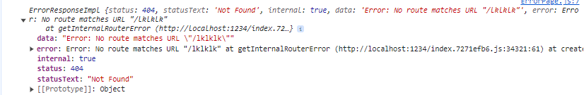
- till now we have implmented basic routing, but the problem is we are losing the structure of the page like Header and footer, let's fix it.
- we are making Header and Footer constant, by creating/using children routes inside createBrowserRouter(), which looks like this
`const appRouter =createBrowserRouter([
    {
        path :"/",
        element : <AppLayout/>,
        errorElement : <ErrorPage/>,
        children :[
            {
                path:"/",
                element:<Body/>,
                errorElement :<ErrorPage/>
            },
            {
                path:"/about",
                element :<About/>
            },
            {
                path:"/contactus",
                element:<Contactus/>
            },
            {
                path:"/cart",
                element:<Cart/>
            }
        ]
    }
]);`

also our AppLayout is using <Outlet/> which renders different childern component dependes upon the URL, this Outlet is the part of "react-router-dom" 
Now, structre of  AppLayout looks like this 
`const AppLayout = () => {
    return (

        <Header/>
        <Outlet/>
    
);
}`
- Basically <Outlet/> is  nothing but a placeholder, where childern component renders, depends upon the URL. 
- While using React never use Anchor tag for the redirection, because whole page gets refreshed, instead use **Link** your page will not reloads and render the required component faster, Link basically creates the anchor tag in the HTML, Link is basically a wrapper over the Anchor tag but it does not refresh the page while if you use Anchor tag directely it will going to refresh the pahe hence Link is called a sspecial component,Link component are a super power which is given by the react-router-dom, the Link component exactely works as the Anchor tag , you need to import it and use it like Anchor tag and pass 'to' attribute which is nothing but the string, you have given to the configuration
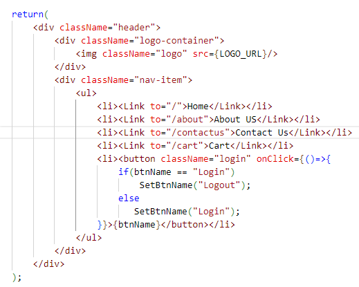   
- when different components renders in the same page it's called single page application
- there are 2 types of Routing in web Apps 1. Client side Routing  2. Server side Routing
- **Client Side Routing**  : In this Routing we are not making the server side call, we are just rendering the specific Component, as all the component were already available inside the browser
- **Server Side Routing**  : after clicking on Anchor tag if the network calls happend and it pull the data from server and render it on the browser it is called as Server side Routing 

## Dynamic Routing
- In this section we are creating a page/component which will shows us details fo restaurant called as Restaurant menu page when we click on it from the list of Restaurant on Home page
- Create a new RestaurantMenu component, and configure the route in children section with dynamic data, "/restaurant/:resId" here :resID denotes a dynamic data, **useParam** is the Hook given by React-router-dom, which is used to read the Parameters from the URL, we are going to read resID with the help of this Hook, eg  ` const params = useParams();`, it will return a object {resID:123}, hence we are going to destructureing 
====================================================Episode 07 Ends here==============================================================================================

# Episode 08 | Let's get classy
- In this Episode we will be learning about **Class based component**, older React application created using the Class based component and new modern React application gets created using the function based component. Knowing class based and function based component will make your understanding more stronger
- To learn Class based component, we are going to create a seprate About US page which is a class based component,  we will going to fetch data from github of the team member and show the data on about us page
- For above functionality we will create a functional component and then we are going to convert it into a class based component, first of all create a class and extends it from React.Component `class UserClass extends React.Component{  }`, this is nothing but a class component, now if you want to render HTML by returning JSX then create a render() method, React.Component is a class given by React to us 
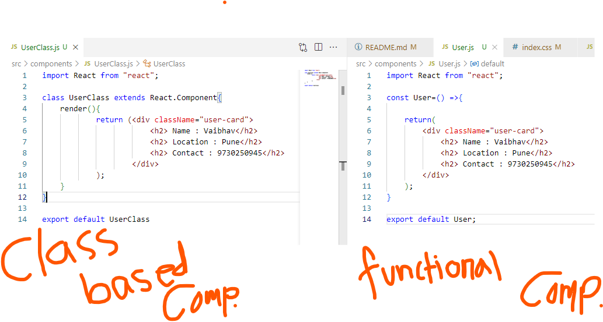

- Now if we want to use **props inside class component**, then pass the paramenter similar way as you pass into the functional component, but to receive the props you need to use the constructor using super(props), and in case you want the data to ba available for rendering as a destructuring object from the props, destructure it inside a render() function. 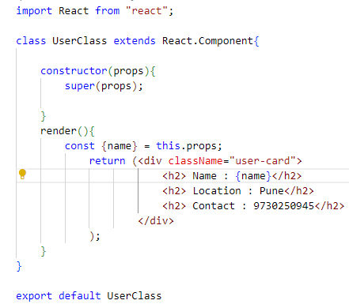
- Loading of class component means creating a instance of the class, whenever a instance is created a constructor is gets called, constructor is the best place to receive the props and to create a state in class based component 
- Now we are going to look into how we can create **state variable in class based component**, State has been created in class component when instance has been created with the help of a reserved word *state*, it is a whole big object you can add many properties inside it like `this.state ={ count : 0 }` , and you can access the state variable like `{this.state.count}` you can also destructure it inside render function similar to props destructure
- if you want to use more state variable just push it into the state variable because it is a object which can contains many object, Now we can use setState() method to update the state variable, never update state variable directely. 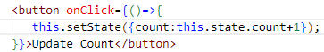
- **React life cycle method** - When class based component encountered anywhere, constructor gets called, it's object gets created, class is instantiated. Once the constructor is called then the render() gets called
- When you Embed a child inside a Parent, basically while using class based component when you use child and parent both class based component then the order of execution is as follows `Parent constructor-> Parent Render-> Child Constructor-> child Render`
- there is a method called **componentDidMount()**, this method gets executed when component gets loaded or mounted, hence the cycle of execution goes in the following way `Constructor -> Render -> componentDidMount`, so for Parent and Child relationship it executes like  `Parent constructor-> Parent Render-> Child Constructor-> child Render -> child componentDidMount -> Parent ComponentDidMount`. Most of the time **componentDidMount() is used for calling the API**, as it gets called exactely next  after a component loads completely. [check the digram here](https://projects.wojtekmaj.pl/react-lifecycle-methods-diagram/), basically there are 2 phase  Render and Commit phase, Render phase executes first and then Commit phase execuyes 
- Render and commit phase will be batched together for the child component of the same type, because rendering/updating the DOM is expnsive operation
        
Parent Constructor
- Parent render

- First Constructor
First Render

- Second Constructor
Second Render
<-Dom Update - In single batch>
First Component DidMoun
Second Component DidMount

Parent ComponentDidMount
## API call to get data in a class component inside componentDidMount()
- For calling API we are using componentDidMount() method, bacause this method gets executed when component gets loaded or mounted, we are just using the fetch() method to fetch the data, initally it will render the Page with the default data, as soon as data gets received set the data in state and then it will update the data
- When we do a setState, then Updating phase start, React triggers Rnder once again, it calculate the difference and then DOM gets updated after that **componentDidUpdate()** method gets called
- **componentWillUnmount()** this method gets called when the component will disappear from the page, or removed from the UI, this function is used to **clean up**. This clean up functionality can be acieve in functional component by retruning a function from the useEffect() hook.   
- so, there are mainly 3 functions which are having specific use 1. componentDidMount()  2. componentDidUpdate  3. componentWillUnmount   [For more info read this](https://www.w3schools.com/react/react_class.asp)

# Episode - 09 | Optimizing the App
- In this Episode we will learn how we can write our APP in better way, How we can optimize our APP, how to make app performant, fast, light weight so that it loads very fast, also we are going to learn about **Custom Hooks**, also we are going to looks into **SOLID**
- **S** -> **Single Responsibilty Principle** : A entity should have a single responsibilty, code becomes reusable, maintainable, testable

## **Custom Hooks**
- Hooks are nothing but the utility functions which is having special powers
- we are going to create our own custom hook, we are going to use it inside RestaurantMenu component
- The major responsibility of RestaurantMenu component is 1. call API grab the data 2.display the data on the UI, we are going to create a Hook which will fetch the data, after implementing this Hook, we are going to acheive single responsibility principle so that components responsibility to just show the restaurant menu and code becomes much cleaner. Now the RestaurantMenu is not concerned how data gets fetched, fetching logic will be abstracted or Hidden  
### Creating useRestaurantMenu() Hook
- Create a seprate file, with exactely same name, always start the name with the word 'use' so that it will be identified as Hook, In this Hook, we are just receiving the resID and fetching the data with the help of fetch() method and store the data in local state variable then we return the same data back, check  useRestaurantMenu.js file.

### Creating useOnlineStatus() Hook
- Now we are going to create new hook to check if the user is online or not, we are going to create a new hook and we are going to use Window:online event you can check the documentation online, this Hook will help you to show you if you are online or offline, to check if you are online or offline you can change the setting of your browser from the network tab, check the code in useOnlineStatus.js file

**Problem** - As your App is growing it will have a lot number of component, Parcel will create a bundled JS file, which will be very big in size, and because of this your APP will be very slow to render the content on the browser, **Solution** - Breakdown your APP into the smaller pieces, so that the bumdling tool Parcel will craete smaller bundle of the JS file, This Process is called as **Chunking**  also called as **code splitting**  also called as **dynamic Bundling** also called as **Lazy Loading**
- **On Demand loading** of the code/content is called **Lazy Loading**, Im make my trip APP, we are loading Flight initially and when user clicks on Hotel we will load Hotel related component, initially we are not loading all the component  

## Bundling/ Lazy Loading/ On Demand Loading 
- How to make smaller bundles, when to make smaller bundle, What should be there in these smaller bundle
- for above problem we need to do the logical sepration of the bundle, means the bundle should have enough code for the feature, for eg. Food delivery, grocery delivery etc. all this is having altogether seprate entity, so we can group them in a bundle, create a component for grocery delivery, But now Grocery is again the part of our food delivery APP, we can seprate it as both are logically different, in APP.js you can see we have imported the grocery component directely imported hence it is creating a single bundle for food delivery and grocery APPs 
- Instead use lazy() from React as a named import, to load the required component, while we are using lazy() we are acheiving the bundling it will create a seprate js file, but it will also throw a new error, as the main JS file was searching for Grocery which is going to lazy loaded but the file for Grocery was not received yet, to solve this problem we need to use suspence [read more here](https://blog.bitsrc.io/lazy-loading-react-components-with-react-lazy-and-suspense-f05c4cfde10c#:~:text=lazy%20function%20handles%20it%20with%20only%20one%20suspense%20component.&text=Then%20add%20the%20lazy%20component,%3Bimport%20'.%2Findex.)
- Suspense is a component given by react, import it as a named import, and wrap the lazy loaded component inside the suspense, it requires a placeholder called as fallback, fallback is used by react to render when the code is not available, you can pass a JSX or a shimmer inside fallback 

# Episode - 10 | Jo dikhta hai wo bikta hai
- In this chapter we are going to see how we can make our APP beautiful, we are going to add styles and CSS and various ways to apply css, we will use a CSS framework to add styles to whole app
- the simplest and old way to add CSS is to add css classes in index.css and refer that css file in our APP
- the next way to use CSS is SASS ans SCSS
- next way is styled component 
- next way is using framework few popular frameworks are Material UI, chakra, bootstrap, ANT design etc.
- we are going to use Tailwind CSS in our APP, configure it inside the APP, Tailwind works with other framework as well, we need to go to framework guides and select Parcel as we are using Parcel in our APP [check here](https://tailwindcss.com/docs/guides/parcel), add configuration for PostCSS, Configure your template paths, Configure your template paths, Add the Tailwind directives to your CSS    
- Now you can use tailwind CSS directely in your component, you can use tailwind VS code extension as well, Now you can add different classess on all the levels of component, also adjust the UI accordingly as per the requirement
- After using tailwind classes, our APP looks like this, we have commented all the CSS we used earlier. 
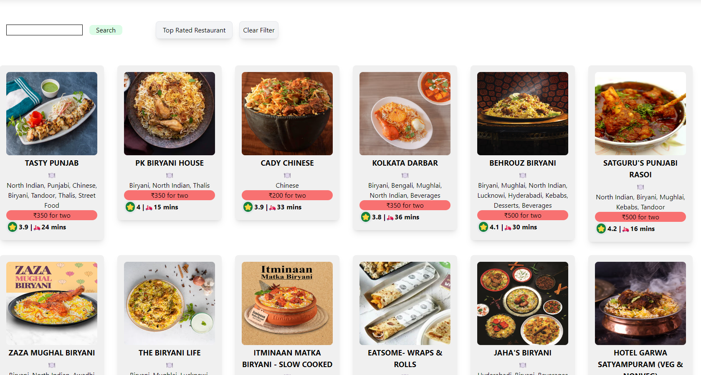

# Episode - 11 | Data is the new oil
## **HOC**
- In this Episode we will learn about **Higher order component** - it is function which takes a existing component as argument and return the component, Higher order component takes the component, it enhances the component, it adds the power/features to that component, and returns it back. it act as a enhancer
- Example, if you see swiggy some of the restaurant is having promoted/ad tag, but it looks similar to normal restaurant card just it is having Promoted/ad tag, we are going to build similar functionality wiht the help of Higher order component. similar example we are going to implement, if you check the data returned from the swiggy API we are getting Promoted : true ot false, we need to use same data
- now go to restaurant card and create new function which will return you the Restaurant with Promoted label, this is nothing but the higher order function, now go to body where you are rendering all the cards for the restaurant, now we will use Higher order component, do a named import for withPromotedLabel, assign it to a const variable, no check if data is having propmoted or not and then render the cards accordingly
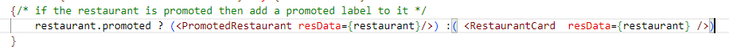
HOC looks like this 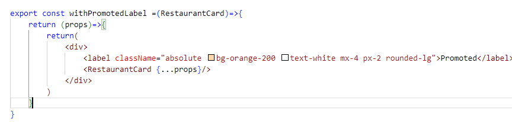 

- Further we are going to design a Restaurant page very similar to swiggy, we have created a seprate component called ResCategory and ItemList, it shows the item list available in the restaurant in the accordian, we have created our own accordian

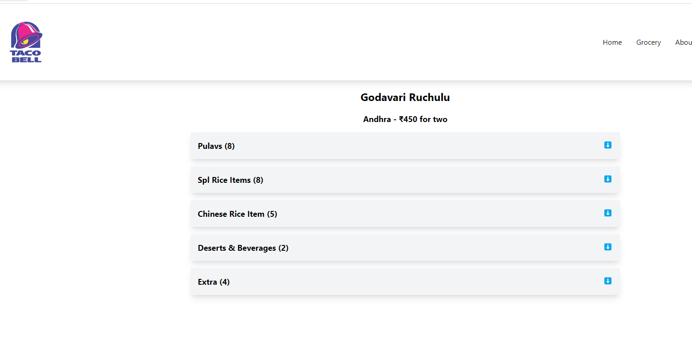

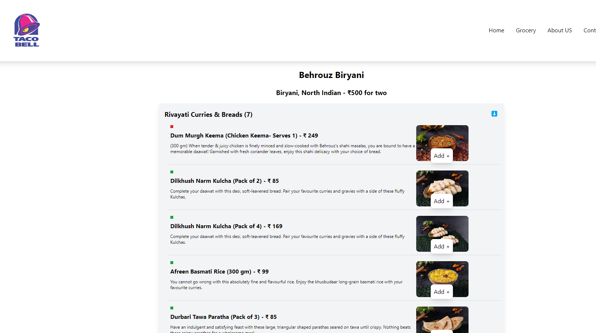

- For Debugging and understanding the code in more better way install the **React Dev Tools** for chrome, it will add power to the DEV tool and gives you the options loke component and profiler
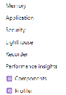, Component shows you the list of component and after selection of any component it shows props, hooks, state etc, you can also called it as a virtual dom, it is capable to show you data layer and the UI layer  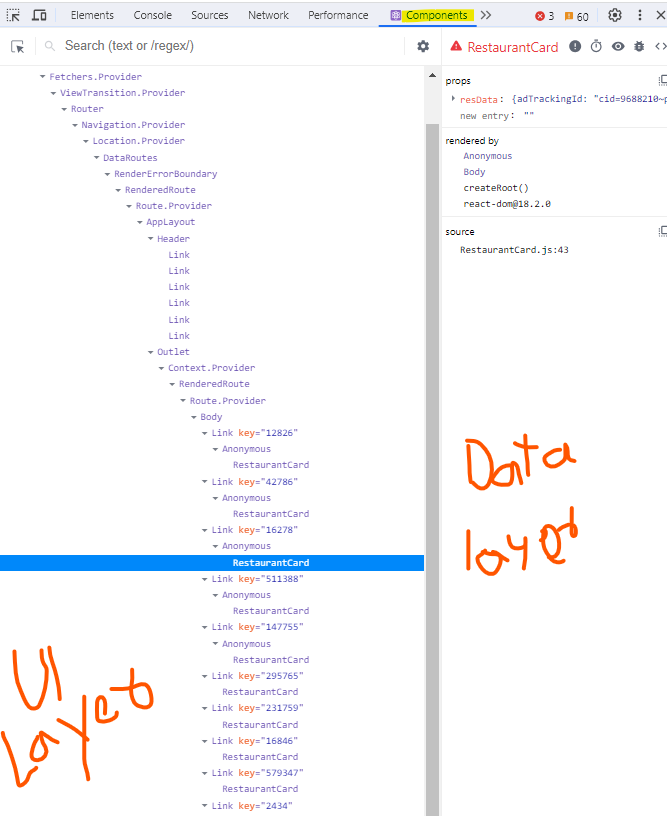 

- In React DEV tools you will have the profiler, profiler is used to record the react application, it shows you different types of the graph about your action
- Now the **problem** here with each Accordian is each accordian is having their own state and at a time they all are opend, we need to acheive the behaviour like we need to close the accordian if anyone is already opened [check the example here](https://getbootstrap.com/docs/5.0/components/accordion/), it is very difficult to acheive this behaviour because every accordian maintain their own state, and to close the accordian we need to change the state of other accordian item.
- To solve this problem instead every accordian maintaine their state of opening and closing we need to give this power to thier parent, now parent will be going to manage the state so that every accrodian item will close and only one will be opened at a time, this phenomenon of controlling the bahiviour of the child by the parent is called as lifting the state up 

## **Lifting state UP**
- As we know, every component in React has its own state. Because of this sometimes data can be redundant and inconsistent. So, by Lifting up the state we make the state of the parent component as a single source of truth and pass the data of the parent in its children.
- Time to use Lift up the State: If the data in “parent and children components” or in “cousin components” is Not in Sync.
- Solution to above problem : For above problem to solve we are using RestaurantMenu(Parent) to handle the state of ResCategory(Child)
- Now we are removing the state from Rescategory, and we will pass a property from it's parent as props, when you implement this type of behaviour is called **controlled component**, here we are controlling the Child component from the parent hence ResCategory(child) is controlled component, next we need the index of the component in which we need to pass showItem as true inside the map function of the RestaurantMenu, so in RestaurantMenu we are declaring a state called showIndex and set default value as 0, so that first one will be opened, Now the challenge is to setShowIndex from the child, but the setShowIndex function is available in the Parent component, to invoke this function from the child is not possible, so we need to use a trick we are going to pass the same function to child componnet and execute the same function on the click handler, the way we are handling the code is used to communicate from child to parent  

## **Controlled and uncontrolled component**
- Controlled components refer to the components where the state and behaviors are controlled by Parent components while Uncontrolled components are the ones having control of their own state and manage the behaviors on themselves.

## **Props Drilling**
- **Problem** : suppose we have a tree of component where diffeent component is attached to a root component, in this component tree there are single root node component, several intermidiate component, and several leaf component, in case we need to pass some data from root node to leaf node, we need to pass the data with the help of props through the intemeidate node component, and these intermidiate node component has nothing to do with the data that is required by leaf node, it is just receiving the data from root  node and pass the same data to leaf node, it's not the good way to pass the data, in this way it is having the responsibility of just passing the data, but imagine if we have a deep tree structure then intermidiate node will just pass the data, it's fine to pass the data through props till one or two levels, so passing data through props till various level is called [**props drilling**](https://react.dev/learn/passing-data-deeply-with-context#the-problem-with-passing-props)
- [Props drilling and How to avoid it](https://www.geeksforgeeks.org/what-is-prop-drilling-and-how-to-avoid-it/) Can we have a solution to this problem, so that we can access any data from any level of the component, YES with the help of **Context API**

## **Context API**
- With Context API, you can create a “context” that holds the user’s shopping information, like their cart and order history. Then, you can use that context in both the shopping cart and the order history component, without having to pass the information down through props. [Read more here](https://www.freecodecamp.org/news/context-api-in-react/)
- Creating a context : Context is common across the application hence we are going to create it inside utils, you can create a context with the help of createContext which is the part of the react, you can also save some default values inside it, but you need to export it which is important.Don't put all the data inside Context. Now you can use the context anywhere inside the application in any component but to naccess the Context you need to use a special hook called **useContext Hook**  
- Now to access the context API data you need to use the useContext Hook and you will get the data 
- **Limitation of useContext Hook** :  you can create a context but you can not access the context with the help of useContext hook inside a class based component, for functional component you can use it with the help of useContext Hook, for the same sceanrio to implement we are using AboutUs class component.
- Solution to above problem - go to AboutUs class component and import UserContext, use the tag with context name and '.context' with it like 
"<UserContext.Consumer>",for class based component it is very similar to the component, it is not Hook, in between this you need to write the JSX, the code looks like this.
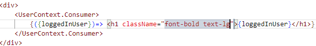
- So there are 2 ways to consime the context 1. with the help of useContext Hook inside the functional component 2.  by using the component method like <UserContext.Consumer> in side the class component
- Till now we have used the context by reading it's value and cretaing a Context, what about writing the Context, let's have a scenario in App.js we are having a authentication code, which is calling a API and it is returning the name of the user, so save the data in a local state you are getting from API, and now wrap your JSX inside the context component and pass a value attribute it will set the data inside the context, basically we are overridding the context values, and then it will refelect the data everywhere  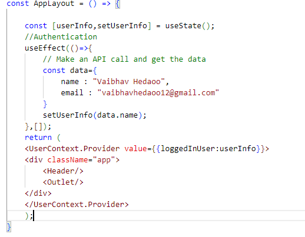  
- Actually it is setting the boundaries of the context, for the same context if you set the different values then different values will reflect in your different section. Otside the bounderies it will give you the default values and inside the defined bounderies it will give you the set values.
- Now, Next we will be going to change the context on the fly with the help of the Input box, next to search button we are going to to craete a input box, Now you need to set the data of UserInfo, for this chande in data we are having the function available in APP.js which is nothing but setUserInfo, but setUserInfo is available inside APP.js we need to change the data inside Body.js 
- so to access setUserInfo inside Body.js we need to pass it from App.js inside UserContext.Provider like `<UserContext.Provider value={{loggedInUser:userInfo,setUserInfo}}>`
- Now do a array destructuring and access the data values along with function `const {loggedInUser,setUserInfo} = useContext(UserContext);`
- use the UI like below code 
                    `

                        Setting context from here as UserName : <input type="text" className="border border-solid border-black p-2" value={loggedInUser} onChange={(e)=>{ setUserInfo(e.target.value)}} />
                
  `
- In this way, what ever you are going to type will be reflect everywhere you use the context values.
 

-------------------------------Note 1---------------------------------
- we are having the CORS issue because 'https://corsproxy.io/?'  has blocked our IP to use 
- Now we have shifted to 'api.allorigins.win/get' code has been  changed slightely
-------------------------------Note 1---------------------------------

-------------------------------Note 2---------------------------------
- we are having the CORS issue because 'api.allorigins.win/get' is not working
- Now we have shifted to 'https://thingproxy.freeboard.io/fetch/' code has been  changed slightely
-------------------------------Note 2---------------------------------

# Notes with Q&A here
- [check this profile](https://github.com/Harshita-Kohli/Namaste-React) with [Linkedin](https://www.linkedin.com/in/harshita-kohli-4499b91b6/recent-activity/all/) 
- [check this github repo](https://github.com/vaibhavhedaoo/fooodvilla)
- [check this github repo](https://github.com/vaibhavhedaoo/table-of-contents_ReactWithHarshi)